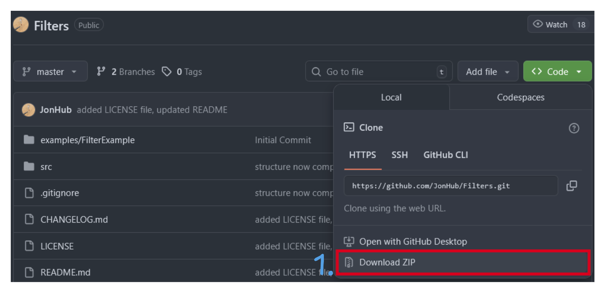
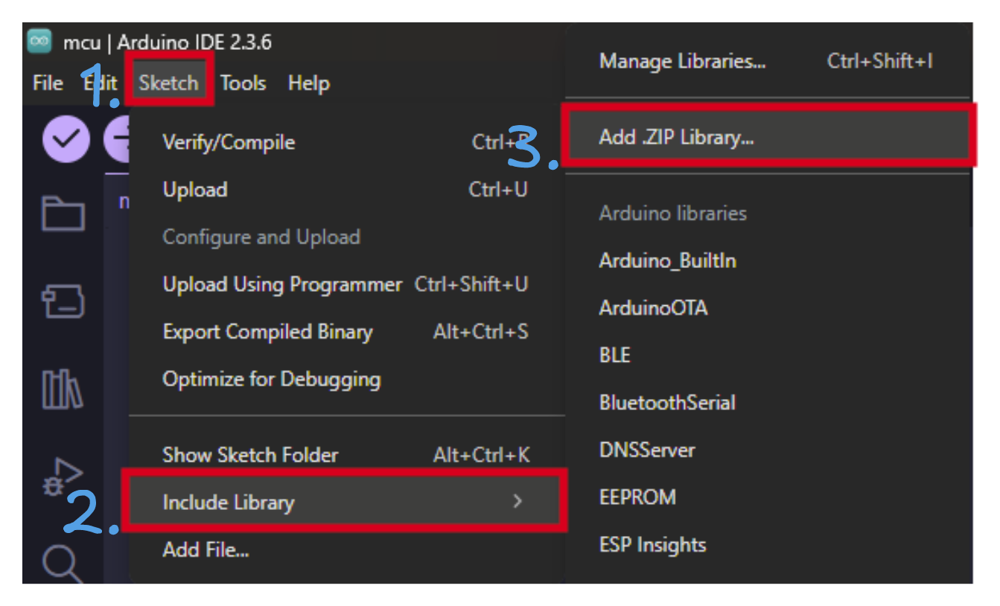
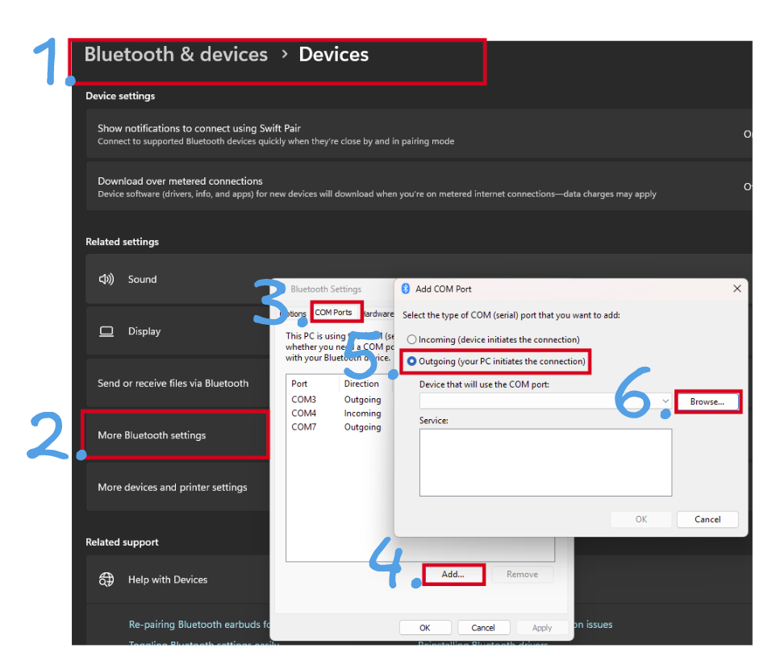
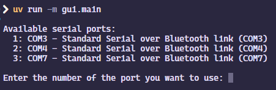
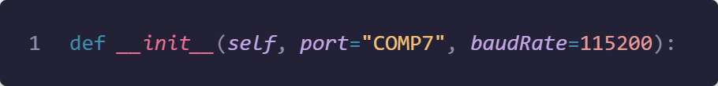

<!-- Generated Using AI and edited by me -->

# PPG Health Monitor

A real-time Photoplethysmography (PPG) signal visualizer and heart rate monitor with a Python-based GUI.

## Table of Contents

- [PPG Health Monitor](#ppg-health-monitor)
  - [Table of Contents](#table-of-contents)
  - [About The Project](#about-the-project)
    - [Features](#features)
    - [Built With](#built-with)
  - [Getting Started](#getting-started)
    - [Hardware Requirements](#hardware-requirements)
    - [Software Prerequisites](#software-prerequisites)
    - [Installation](#installation)
  - [Usage](#usage)
  - [Troubleshooting](#troubleshooting)
    - [Bluetooth Connection Issues](#bluetooth-connection-issues)

## About The Project

This project, developed for the BMET2922 course, is a desktop application for real-time health monitoring using a PPG sensor connected via Bluetooth. It captures raw PPG data, calculates beats per minute (BPM), and displays the information through an intuitive graphical user interface.

### Features
*   **Live Data Visualization**: Real-time plotting of raw PPG signals and calculated heart rate.
*   **User Account Management**: Simple login system to manage and save session data for different users.
*   **Session History**: Stores and displays historical session data, including average/min/max BPM and duration.
*   **Configurable Alarms**: Set custom high and low BPM thresholds with visual alerts for abnormal readings.
*   **Bluetooth Connectivity**: Connects to an ESP32-based PPG sensor to stream data wirelessly.

### Built With
* [Python](https://www.python.org/)
* [PyQt5](https://riverbankcomputing.com/software/pyqt/) for the Graphical User Interface (GUI)
* [NumPy](https://numpy.org/)
* [PyQtGraph](http://www.pyqtgraph.org/) for high-performance plotting
* [SciPy](https://scipy.org/) for signal processing
* [PySerial](https://pyserial.readthedocs.io/) for Bluetooth communication
* [NeuroKit2](https://neuropsychology.github.io/NeuroKit/introduction.html) For PPG signal processing
  

## Getting Started

This section will guide a user or developer on how to get your project set up and running on their local machine.

### Hardware Requirements
- **ESP32 microcontroller** (any ESP32 development board)
- **PPG sensor** connected to ESP32 analog pin
- **Computer** with Bluetooth capability
- **USB cable** for programming ESP32

### Software Prerequisites

This project requires Python 3.8+ and `pip` to be installed.

You can install the necessary Python packages using the `requirements.txt` file.

### Installation

1.  **Clone the repository**
   ```sh
   git clone https://github.com/dan1e1z/BMET2922-Major-Project.git
   cd BMET2922-Major-Project
   ```

2.  **Create and activate a virtual environment**

    This is highly recommended to avoid conflicts with other Python projects.

    *   On **macOS/Linux**:
        ```sh
        python3 -m venv .venv
        source .venv/bin/activate
        ```

    *   On **Windows** (using Powershell):
        ```sh
        py -m venv .venv
         ./.venv/Scripts/activate.ps1
        ```
 
3.  **Install the required packages**

    You can install all dependencies from the `requirements.txt` file.
    ```sh
    pip install -r requirements.txt
    ```

4. **Set up Arduino IDE for ESP32**

    **Install Arduino IDE:**
    - Download from [arduino.cc](https://www.arduino.cc/en/software)

    **Add ESP32 board support:**
    - Open Arduino IDE → File → Preferences
    - Add this URL to "Additional Boards Manager URLs": `https://dl.espressif.com/dl/package_esp32_index.json`
    - Tools → Board → Boards Manager → Search "ESP32" → Install "esp32 by Espressif Systems"

    **Install required libraries:**
    - Tools → Manage Libraries → Install "BluetoothSerial" by Espressif Systems
    - Download and install these ZIP libraries:
      - [PeakDetection](https://github.com/leandcesar/PeakDetection)
      - [Filters](https://github.com/JonHub/Filters)
    
    
    

    **Upload code to ESP32:**
    - Open `mcu/mcu.ino` in Arduino IDE
    - Select ESP32 board from Tools → Board
    - Select COM port from Tools → Port
    - Click Upload button

5. **Connect ESP32 via Bluetooth**

    Power on your ESP32, then pair it with your computer:
    
    

## Usage

To run the application, ensure your virtual environment is activated and execute the `main.py` script from the project's root directory:
```sh
python -m gui.main
```

The app will prompt you to select the COM port for your ESP32 connection, then start with a login screen.


**Available Tabs:**
- **Live Monitor**: View real-time PPG signals and heart rate data
- **Account**: Create accounts, login/logout, manage user settings  
- **Health History**: View past monitoring sessions with statistics
- **Research**: Advanced analysis tools (requires advanced account type)

**Getting Started:**
1. Create a user account (choose "personal" or "advanced")
2. Ensure ESP32 is powered on and Bluetooth connected
3. Go to Live Monitor tab to start recording heart rate data
4. Adjust BPM thresholds in the settings to receive alerts

## Troubleshooting

### Bluetooth Connection Issues

If you are having issues with the port selection, you can manually set the port by modifying the following line in `gui/core/bluetooth_monitor.py` at line 66:

Change the port to your Bluetooth port.



**Author**: Daniel Lindsay-Shad
